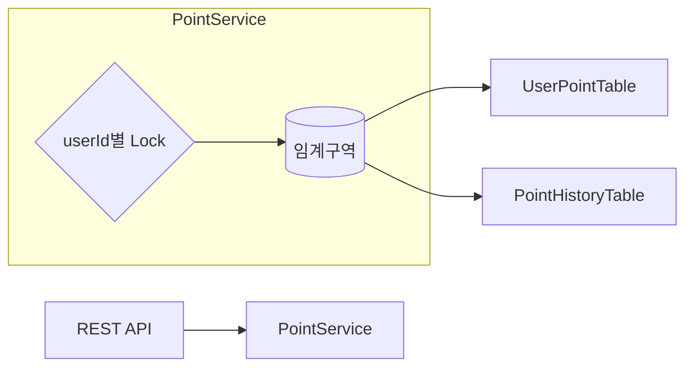

## 동시성 제어 분석 보고서
### 현재 적용안 (단일 JVM 기준)
#### Per-User Lock (ConcurrentHashMap + ReentrantLock)
- 아이디어: userId → ReentrantLock 매핑으로 같은 사용자 요청만 직렬화. 다른 사용자끼리는 병렬 허용
- 핵심 순서: 검증 → 조회 → 계산 → 업데이트 → 이력
- 오류 처리: 업데이트 실패 시 이력 기록 금지(순서상 불가능)

```java
// 요지 코드
private final ConcurrentHashMap<Long, ReentrantLock> userLocks = new ConcurrentHashMap<>();

private ReentrantLock lockOf(long userId) {
    return userLocks.computeIfAbsent(userId, k -> new ReentrantLock(true)); // 공정 락
}

public 메서드 () {
    // 예시 사용
    ReentrantLock lock = lockOf(userId);
    lock.lock();

    try {
        ... // 검증, 조회, 계산, 업데이트
    }finally {
        try {
            releaseIfIdle(userId, lock);
        } finally {
            lock.unlock();
        }
    }
}
```

### 구조


### 대안
| 방식                                     | 장점                               | 단점                         | 적용 시점              |
| -------------------------------------- | -------------------------------- | -------------------------- | ------------------ |
| **ConcurrentHashMap + ReentrantLock**  | 구현 간단, 빠름, 단일 JVM에 적합            | 멀티 인스턴스에선 무력               | **현재** (개발/단일 서버)  |
| **DB 비관적 락 (`SELECT … FOR UPDATE`)**   | 분산 환경에서 안전, 단일 소스오브트루스           | DB 부하↑, 지연↑                | 다중 인스턴스, 강한 일관성 필요 |
| **DB 낙관적 락(버전 필드)**                    | 충돌 적을 때 성능 좋음                    | 충돌 시 재시도 필요                | 중간 QPS, 경쟁 낮은 패턴   |
| **원자 쿼리(증감)**                          | 간결(UPDATE SET point = point + ?) | 복합 로직(이력/검증)엔 부족           | 단순 카운터/캐시성         |
| **Redis 분산 락 (e.g., RedLock)**         | 분산 환경 전용, 유연                     | Redis 운영/가용성 고려, TTL/해제 이슈 | 수평 확장, DB 락 회피 시   |
| **메시지 큐 직렬화(Kafka partition by user)** | 자연스러운 직렬화/백프레셔                   | 실시간성↓, 구조 복잡               | 트래픽↑, 일괄 처리 선호     |


### 개선
1. 읽기 → 무락 유지(스냅샷 허용), 쓰기 → 분산락/DB락
2. 단기: DB 비관락으로 포팅 (가장 단순/확실)
3. 장기: 트래픽 패턴 따라 선택
    - 낙관락 + 재시도 (경쟁 낮음)
    - Redis 락 (경쟁 중간, DB 부하 회피)
    - Kafka 파티션 (고QPS/백프레셔 필요)

### 결론
- 현재: 단일 JVM에서 Per-User Lock이 가장 단순하고 빠른 해법
- 확장: 멀티 인스턴스 전환 시 DB 락/낙관락, Redis 락, Kafka 파티션 중 업무 특성에 맞게 선택
- 테스트/모니터링/멱등성까지 갖추면 운영 안정성이 크게 향상

### 느낀 점 (회고 / Lessons Learned)
- Per-User 락은 단일 JVM에서 정확성·단순성·성능의 균형이 좋다.
- 업데이트 → 이력, 산술 안전, 락 해제 보장, 상태 기반 테스트는 필수 베스트 프랙티스.
- 트래픽/배포 구조가 커지면 분산 락/DB 트랜잭션/큐 직렬화로 자연스럽게 승격하자.